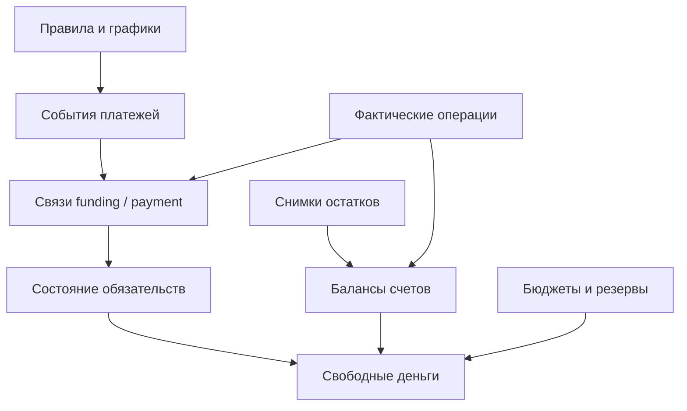

# Архитектура

> ID: architecture · Для: developer, agent · Тип: observed_snapshot
>
> Компоненты, модели долга и границы доступа. [Карта документации](index.md) · [Манифест](manifest.json)

## Ответственность компонентов

| Компонент | Ответственность |
|---|---|
| Ассистент и адаптер | Понять запрос, разрешить названия в ID, уточнить недостающие сведения, вызвать функцию, показать результат |
| Прикладные SQL-функции | Записать согласованную операцию, рассчитать состояние и сформировать статус |
| Таблицы и ограничения | Хранить факты и планы, обеспечивать связи и допустимые значения |
| Триггеры | Нормализовать операции, обновлять производные связи и проверять согласованность |
| Планировщик, если подключён | Вызвать согласованное действие по расписанию с нужным часовым поясом |

SQL-база является источником денежных результатов. Ответы модели и память чата не заменяют актуальные данные.

## Связи ядра

## Группы данных

| Группа | Таблицы |
|---|---|
| Деньги и справочники | `accounts`, `categories`, `transactions`, `account_balance_snapshots` |
| Календарь и обеспечение | `cash_flow_rules`, `cash_flow_events`, `cash_flow_event_funding` |
| Долги | `liabilities`, `liability_balance_snapshots`, `liability_movements`, `liability_payment_schedule`, `debt_payment_details`, `debt_goals` |
| Плановые резервы | `living_budgets`, `planned_purchases` |
| Категории и чеки | `transaction_category_allocations`, `receipts`, `receipt_items` |
| Настройки | `finance_settings` |

`balance_snapshots` — представление совместимости, а таблица снимков денег называется `account_balance_snapshots`. Не создавайте дубликат таблицы по старому названию.

## Две модели долга

| Модель | Источник состояния | Оплата |
|---|---|---|
| `revolving_account` | Связанный счёт `credit_card`; функции расчёта долга | Деньги поступают на связанный кредитный счёт |
| `installment` | Снимки долга, движения и банковский график | Сначала обеспечение буфера, затем списание с разбивкой тела/процентов/комиссии |

Поле `principal_current` обновляется механизмами синхронизации. Его нельзя произвольно редактировать как независимый достоверный остаток, игнорируя расчётную модель.

## Производные данные

Сохранённые поля обеспеченности и статуса упрощают работу, но отчётное состояние вычисляется с учётом связей и времени. Генерация календаря использует `source_key` для сопоставления существующих событий с источниками.

Изменение правил способно обновить или отменить неисполненные события. Если удаляемое из источника событие уже имеет распределения денег, текущий генератор требует сначала согласовать эти связи.

## Транзакции и повторы

`finance_command` использует транзакционную advisory-блокировку и `external_ref` как ключ повторного запроса. При совпадении ключа и исходного JSON возвращается прежний ID; при ином содержимом выбрасывается ошибка.

Часть проверок выполняется отложенными триггерами. Успех отдельного `INSERT` не равен успешному `COMMIT`; интеграция подтверждает запись только после успешного завершения всей транзакции.

Идемпотентность не является авторизацией. Прямой доступ к таблицам способен обходить прикладной маршрут и должен оцениваться отдельно.

## Граница доступа

При обследовании:

- во всех 19 таблицах `public` RLS выключен;
- политики RLS для этих таблиц не обнаружены;
- 76 обследованных функций не используют `SECURITY DEFINER`;
- у функций обнаружено разрешение `EXECUTE` для `PUBLIC`, а также явные разрешения для клиентских ролей.

Это наблюдение о схеме, а не результат внешнего теста доступности через интернет: настройки Data API, права на таблицы и ограничения конкретного адаптера требуют отдельной проверки.

Схема не содержит подтверждённой модели владельца каждой финансовой записи. Первая версия должна использовать отдельный контур данных на владельца. Для общего сервиса потребуются проектирование владельцев записей, авторизация и тесты изоляции.

В экспортируемом установщике доступ задан отдельно: RLS включён, права PUBLIC и стандартных клиентских ролей отозваны, представления используют права вызывающего. Работает владелец объектов; клиентская роль требует отдельной настройки. [Профиль новой установки](source-code.md#access). Разрешения объектов и правила доступа к строкам решают разные задачи. Нельзя считать скрытый URL или ключ заменой авторизации. [Безопасность API Supabase](https://supabase.com/docs/guides/api/securing-your-api)

Рабочая база при подготовке этой документации не изменялась.
